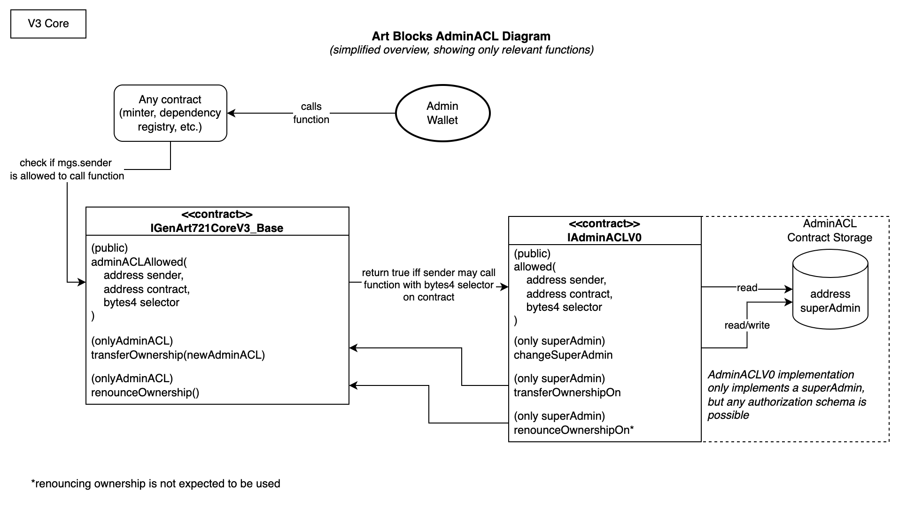
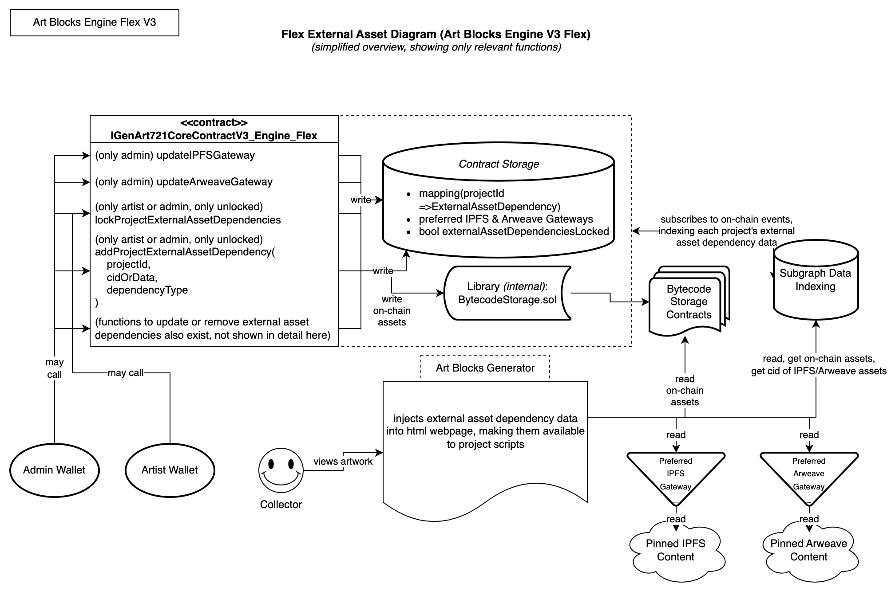

# V3 Contract Architecture

## Overview

This page is intended to provide an overview of the V3 contract architecture. This page is intended for developers and other technical users. For more information on how to use the Art Blocks platform, please see the [Art Blocks documentation site](https://docs.artblocks.io/).

## V3 Core Contract

The V3 core contracts are the ERC-721 NFT contracts that house Art Blocks Flagship and Art Blocks Engine V3 tokens. In addition to being an NFT contract, V3 contracts manage metadata for all Art Blocks NFTs, including artist scripts, token hashes, and token royalty data.

The V3 core contract integrates with a few peripheral contracts to offer flexible, customizable, and extensible functionality. These contracts include:

- [Admin Access Control List (ACL) contract](#admin-access-control-list-acl-contract)
- [Randomizer contract](#randomizer-contract)
- [Core Registry contract](#core-registry-contract)
- [Minter Suite contracts](#minter-suite-contracts)
- [Royalty Registry contract (by Manifold)](./ROYALTIES.md)

Additionally, the [V3 Engine Flex contract](#flex-external-asset-dependencies) is designed to integrate with external assets, such as images, videos, audio, or other data, and may be stored on decentralized storage systems such as IPFS, Arweave, or on the Ethereum blockchain.

## Integrations

### Admin Access Control List (ACL) contract

The Admin Access Control List (ACL) contract is used to manage granting admin access to the V3 core contract and related contracts. The contract is designed to be highly flexible and extensible, and can be used to manage admin access for any contract in the Art Blocks ecosystem.

Currently, a simple Admin ACL contract with a single `superAdmin` wallet (multisig) is used to manage admin access for V3 core contracts. The implementation is designed to be easily upgradable, and can be replaced with a more complex ACL contract in the future.

A diagram of the V3 core contract and Admin ACL contract integration is shown below:

### Randomizer contract

The Randomizer contract is used to generate pseudo random numbers for the V3 core contract, when new tokens are minted. This architecture is designed to be highly flexible, enabling designs that may desire to use asynchrounous random number generation or other hash generation methods (such as our Polyptych Randomizer contract).

A shared randomizer was developed as part of our shared minter suite development, and may be used to generate random numbers for all V3 tokens. The randomizer is designed to handle all globally approved shared minters, including minters that may assign token hashes directly such as the Polyptych minter.

A diagram of the V3 core contract and Randomizer contract integration is shown below:

### Core Registry contract

The Core Registry contract performs two functions:

1. Notifies our subgraph indexing service of newly deployed Art Blocks Engine contracts. When the Core Registry emits an event, the subgraph indexing service is notified and the Engine contract is indexed and made available for querying on the Art Blocks subgraph.
2. Provides an on-chain registry of all V3 Art Blocks core contracts. This registry is used by the shared minter filter contract to validate that a given project is on a valid and approved Art Blocks V3 Core contract, approved for use on the Art Blocks platform. This is primarily done to prevent phishing attacks, limiting shared minters to only minting tokens on approved Art Blocks V3 Core contracts.

A diagram of the V3 core contract and Core Registry contract integration is shown below:

### Minter Suite contracts

The Minter Suite is a collection of contracts that are used to mint Art Blocks Engine V3 tokens. The Minter Suite is designed to be highly flexible, and can be used to mint tokens in a variety of ways.

For more information on the Minter Suite, please see the [Minter Suite documentation](./MINTER_SUITE.md).

### Flex External Asset Dependencies

The V3 Engine Flex contract is designed to allow artists to use external assets in their Engine tokens. These external assets can be images, videos, audio, or other data, and may be stored on decentralized storage systems such as IPFS, Arweave, or on the Ethereum blockchain.

A diagram of the V3 Engine Flex contract and external asset dependencies is shown below:

